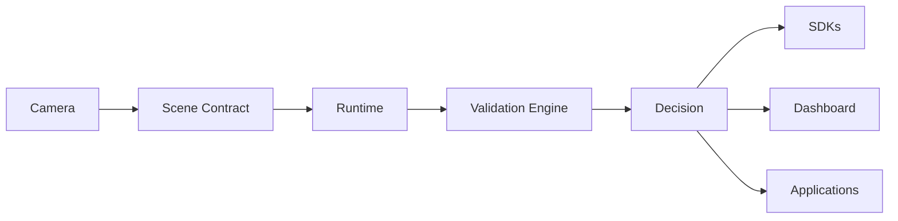

# Vision-Native Cognitive Runtime (VAOS™)
### Vision Agent Operating System

**VAOS is a vision-native cognitive runtime for machine perception. 
  It transforms camera observations into validated scene understanding through Scene Contracts, 
  temporal memory, reasoning, validation, and decision orchestration.**

```
Observe → Structure → Think → Validate → Act → Learn
```



---

## Current Status

| | Component | Version |
|---|-----------|---------|
| 🟢 | Governance | 1.0 |
| 🟢 | Scene Contract | 1.0 |
| 🟢 | SDK | 1.0 |
| 🟢 | Dashboard Demo | Available |
| 🟡 | Runtime Documentation | In Progress |
| 🟡 | Public Website | In Progress |
| 🔵 | Future Ecosystem | v2.5+ |

---

## Open Ecosystem

| Repository | Purpose |
|------------|---------|
| [vaos-docs](https://github.com/vaos-online/vaos-docs) | Canonical ecosystem documentation |
| [vaos-scene-contract](https://github.com/vaos-online/vaos-scene-contract) | Canonical Scene Contract schema and versioning |
| [vaos-sdk](https://github.com/vaos-online/vaos-sdk) | Python and JavaScript reference SDKs |
| [vaos-dashboard-demo](https://github.com/vaos-online/vaos-dashboard-demo) | Demo assets, replay traces, and operator views |
| [vaos-governance](https://github.com/vaos-online/vaos-governance) | Policies, standards, and decision records |

---

## Roadmap

| Version | Milestone | Status |
|---------|-----------|--------|
| v2.0 | Runtime Stabilization | ✓ |
| v2.1 | Sensor Fusion | Planned |
| v2.2 | Memory Summaries | Planned |
| v2.3 | Predictive Reasoning | Planned |
| v2.5 | Adaptive Perception | Planned |
| v2.7 | Multi-Agent Runtime | Planned |
| v3.0 | Ecosystem Platform | Planned |

---

## Mission

Build the open perception and cognition infrastructure layer  
for robotics, automation, vision systems, and physical AI.

Every camera that speaks the Scene Contract is compatible with every VAOS runtime.  
Every decision passes through the Validation Engine.  
Every observation is structured before it is interpreted.

---

## Links

- **Website:** [vaos.online](https://vaos.online)
- **Discord:** [discord.gg/Mg7TztrU](https://discord.gg/Mg7TztrU)
- **Documentation:** [vaos-docs](https://github.com/vaos-online/vaos-docs)
- **Scene Contract:** [vaos.online/schemas/scene.schema.json](https://www.vaos.online/schemas/scene.schema.json)

---

© 2026 VAOS™ — Powered by [eye3.ai](https://eye3.ai)
